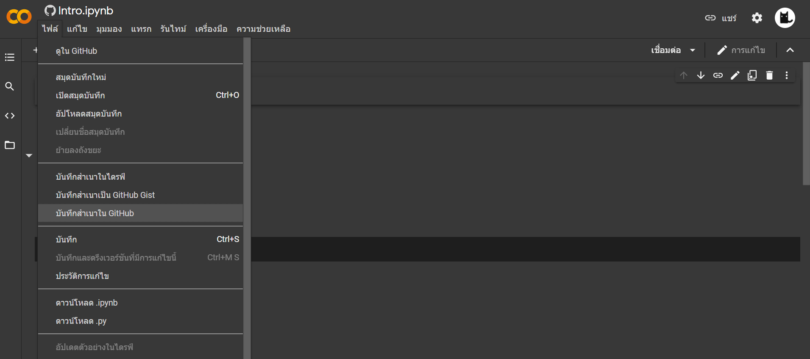
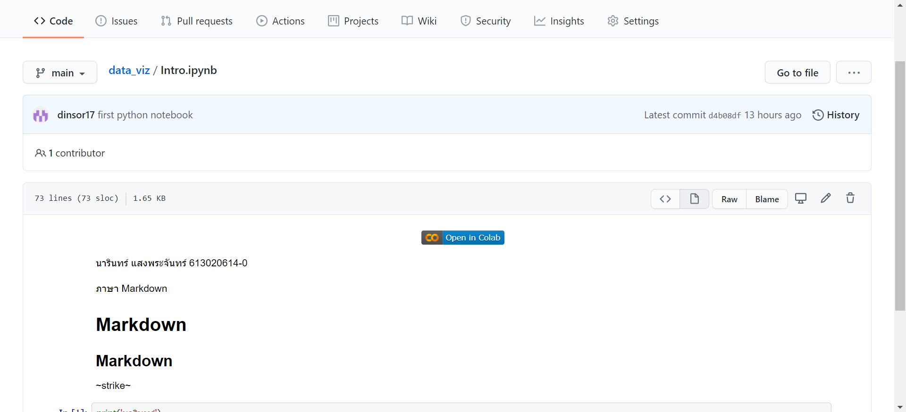

# data_viz

นารินทร์ แสงพระจันทร์ 613020614-0

ตัวอย่างการแทรกรูป

# HW1 การ Save file จาก Colab ไปยัง Github

1. คลิกที่ 'ไฟล์' แล้วเลือก 'บันทึกสำเนาใน GitHub'

2. เลือกที่จัดเก็บและตั้งชื่อตรงข้อความคอมมิตตามที่เราต้องการแล้วกด 'ตกลง'

แล้วจะปรากฎดังนี้

